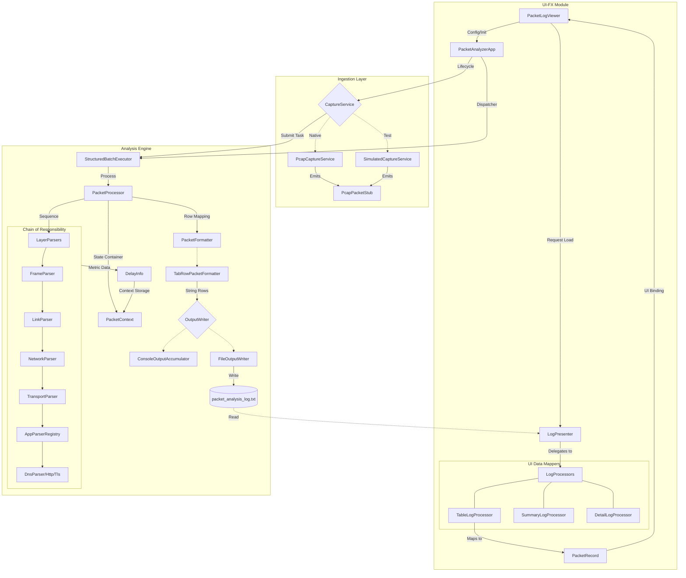

# NetPackSys Technical Workflow & Architecture

This document describes the internal workflow of the NetPackSys application, detailing the roles of core components and the sequence of operations for packet capture and analysis.

## 1. System Overview
NetPackSys is a modular Java application designed for real-time network packet capture and delay analysis. It follows a **Producer-Consumer** architecture using a multithreaded **Structured Batch Execution** model.

### Modules:
- **Core Module**: Handles packet capture, protocol parsing, nodal delay calculations, and persistence.
- **UI-FX Module**: A JavaFX graphical interface for configuration and log visualization.

---

## 2. Key Components & Roles

### A. Orchestration
- **`PacketAnalyzerApp`**: The main driver. It initializes the capture service, processor, and executor. It manages the lifecycle of a capture session.

### B. Ingestion Layer (`CaptureService`)
- **`PcapCaptureService`**: Uses the Pcap4J library to interface with native network drivers (Npcap/WinPcap) for live data.
- **`SimulatedCaptureService`**: Generates synthetic packets for testing and demonstration when native drivers are unavailable or not required.

### C. Analysis Engine (`PacketProcessor`)
The logic center of the application. It performs:
- **Parsing**: Delegates to a chain of `LayerParser` objects (Link, Network, Transport, Application).
- **Filtering**: Matches packets against user-specified protocols.
- **Delay Calculation**: Computes Nodal Delay (Processing, Transmission, Propagation, and Queuing delays) stored in the `PacketContext`.
- **Formatting**: Converts the analysis results into structured log rows using `PacketFormatter`.

### D. Concurrency Model
- **`StructuredBatchExecutor`**: A custom wrapper around `ExecutorService`. It uses a **Phaser** to ensure "Structured Concurrency" — it submits packet processing tasks in batches and ensures all analysis is complete before the application shuts down.

### E. Data Flow & State
- **`PacketContext`**: A stateful container that travels through parsers, accumulating decoded data and metadata for a single packet.
- **`OutputWriter`**: Directs formatted results to the console and `packet_analysis_log.txt`.

---

## 3. Class Relationship & Detailed Flow Diagram

This diagram provides a comprehensive view of the major classes across the **UI** and **Core** modules, illustrating the complete lifecycle of a packet from raw capture to visual record.

### Major Class Roles & Interactions:
1.  **`Config` (Record)**: Immutable state holding interface selection, duration, and protocol filters.
2.  **`PacketAnalyzerApp`**: The "God Object" or Orchestrator that wires the ingestion and analysis modules together.
3.  **`CaptureService` Hierarchy**: Uses `Pcap4j` (`PcapCaptureService`) or custom logic (`SimulatedCaptureService`) to feed raw `PcapPacketStub` objects into the pipeline.
4.  **`PacketContext`**: The critical state container for a single packet. It holds the `rawData`, `layers` (parsed headers), and `delayInfo` (calculated metrics).
5.  **`LayerParser` Suite**:
    -   **`FrameParser`**: Metadata (length, arrival time).
    -   **`NetworkParser`**: IPv4 decoding + Routing/Propagation delay logic.
    -   **`TransportParser`**: TCP/UDP flags and bit-formatting logic.
    -   **`ApplicationParserRegistry`**: Selects **`DnsParser`**, **`HttpParser`**, or **`TlsParser`** based on ports.
6.  **`DelayInfo`**: Stores the four components of Nodal Delay (Proc, Trans, Prop, Queue) for each layer.
7.  **`TabRowPacketFormatter`**: Serializes the `PacketContext` into the multi-line, tab-separated format required by the log file.
8.  **`FileOutputWriter`**: Handles I/O, ensuring the log file is overwritten/appended correctly.
9.  **`LogPresenter` & `LogProcessors`**: The bridge back to the UI. They parse the raw logs into **`PacketRecord`** domain objects for the JavaFX TableView.

---

## 4. The Technical Workflow (Sequence)

### Phase 1: Configuration & Initialization
1.  **User Input**: `ConsoleUI` or `PacketLogViewer` collects parameters.
2.  **Smart Traffic Discovery (GUI only)**:
    - The system performs a background **Traffic Audit** using `PcapHandle` on all active interfaces.
    - It counts packets for 300ms to calculate live traffic volume.
    - Interfaces with high activity are prioritized and marked with a 🔥 symbol.
3.  **Elevation**: The system checks for Administrator privileges (required for `PcapCaptureService` and Traffic Auditing).
4.  **Bootstrapping**: `PacketAnalyzerApp` is instantiated with a `Config` record. It pre-loads the `LayerParser` registry.

### Phase 2: Capture & Dispatch
1.  **Start**: The chosen `CaptureService` starts a background capture loop.
2.  **Ingestion**: For every packet received:
    - The `CaptureService` wraps the raw data in a `PcapPacketStub`.
    - It dispatches a task to the `StructuredBatchExecutor`.

### Phase 3: Parallel Analysis
1.  **Concurrent Processing**: The `ExecutorService` pulls tasks from the queue.
2.  **Layered Parsing**: Parsers execute in sequence:
    - `FrameParser` -> `NetworkParser` -> `TransportParser` -> `ApplicationParser`.
3.  **Calculation**: `Nodal Delay` is calculated based on packet length and simulated network characteristics.
4.  **Logging**: The `PacketProcessor` formats the `PacketContext` and triggers `OutputWriter`.

### Phase 4: Finalization & Visualization
1.  **Shutdown**: After the duration expires, the capture stops. The `StructuredBatchExecutor` awaits all pending analysis tasks.
2.  **UI Refresh**: The `PacketLogViewer` detects the update to the log file.
3.  **Presentation**: `LogPresenter` reads the file, passes it through `LogProcessors` (Summary, Detail, Delay, Table), and populates the GUI.

---

## 5. OOP Features & Software Architecture

The application is built on modern Object-Oriented principles to ensure maintainability, scalability, and testability.

### A. Core OOP Principles Applied
- **Encapsulation**: 
    - **`PacketContext`**: Encapsulates the complex state of a packet from raw bytes to fully parsed layers and calculated delays. It protects the integrity of the analysis data.
    - **`Config` (Record)**: Uses Java Records for shallowly immutable configuration state.
- **Inheritance & Polymorphism**:
    - **`CaptureService` Hierarchy**: `PcapCaptureService` and `SimulatedCaptureService` inherit from the same interface. The system treats them polymorphically, allowing seamless switching between live data and simulation.
    - **`LayerParser` Chain**: Various parsers (Link, Network, etc.) inherit from a base abstraction, allowing the `PacketProcessor` to iterate through them without knowing their specific types.
- **Abstraction**: 
    - Interfaces like `OutputWriter`, `CaptureService`, and `PacketHandler` hide implementation details (e.g., whether we are writing to a file or console, or capturing via pcap4j or a random generator).

### B. SOLID Architecture Implementation

#### **S** - Single Responsibility Principle (SRP)
- Each class has one job. `FileOutputWriter` only writes to files; `DnsParser` only parses DNS; `PacketProcessor` only orchestrates the analysis of a single packet. This makes the code easier to debug and test.

#### **O** - Open/Closed Principle (OCP)
- The system is **open for extension but closed for modification**. To add support for a new protocol (e.g., FTP), one simply creates a new `LayerParser` and registers it. The core capture and execution loops remain untouched.

#### **L** - Liskov Substitution Principle (LSP)
- Implementations of `CaptureService` are interchangeable. The `PacketAnalyzerApp` works identically whether provided with a `SimulatedCaptureService` or a `PcapCaptureService`, as long as the contract is honored.

#### **I** - Interface Segregation Principle (ISP)
- Custom functional interfaces like `PacketHandler` provide exactly what the consumer needs (`handle(packet)`) without forcing dependencies on the entire Pcap ecosystem.

#### **D** - Dependency Inversion Principle (DIP)
- **High-level modules** (`PacketAnalyzerApp`) do not depend on **low-level modules** (Npcap drivers). Instead, both depend on **abstractions** (`CaptureService`). Dependencies are injected via constructors (Dependency Injection), making the core logic independent of the data source.

---

## 6. Class Responsibility Matrix

| Component | Responsibility | Who/What |
| :--- | :--- | :--- |
| **Data Source** | Raw Packet Acquisition | `PcapCaptureService` / `SimulatedCaptureService` |
| **Data Parser** | Decoding Bytes to Headers | `parser.LayerParser` (Subclasses) |
| **Logic Engine** | Protocol Filtering & Delay Math | `PacketProcessor` |
| **Executor** | Thread Management | `StructuredBatchExecutor` |
| **Persistence** | File Writing | `FileOutputWriter` |
| **View Logic** | GUI Management | `PacketLogViewer` |
| **Presenter** | Data Transformation for UI | `presenter.LogPresenter` |
